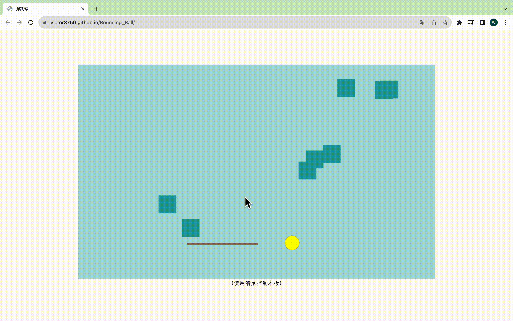

# Bouncing_Ball
DEMO:[https://victor3750.github.io/Bouncing_Ball/](https://victor3750.github.io/Bouncing_Ball/)

# 設計邏輯
使用class語法搭配for迴圈創建多個物件（被撞擊的磚塊）並給予每個磚塊隨機座標，再透過setInterval不斷更新球體座標，同時利用canvas重新繪製，藉此呈現球在移動的視覺效果
